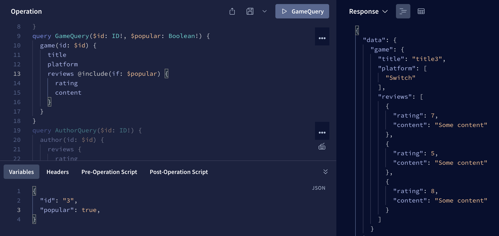
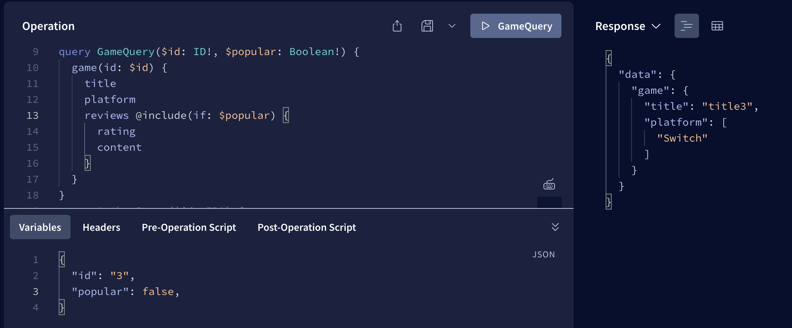

📌 This app combines separate instances of Apollo Client for local server and the external API.

Run `yarn` to install dependencies.

Run `yarn dev` to run the dev server.
Navigate to [localhost:5173](http://localhost:5173) for the pokemon app

Run `yarn nodemon index` to run the apollo server.
Navigate to [localhost:4000](http://localhost:4000) for the apollo server

Directives

@include(if: Boolean) Only include this field in the result if the argument is true.

@skip(if: Boolean) Skip this field if the argument is true.

